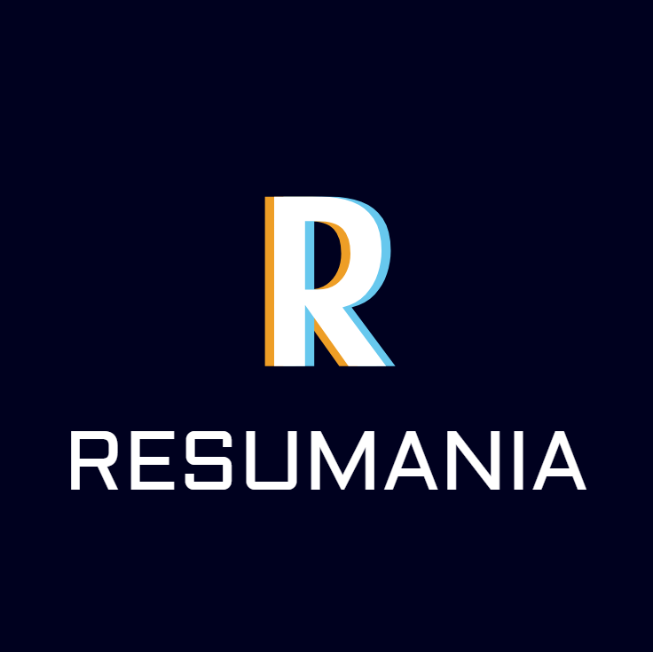

## Game Description
Welcome to Resumania, a fast-paced action game where you take control of a resume trying to navigate the chaotic job market! Inspired by the classic Frogger, your mission is to dodge the perilous hazards of ATS bots, spam filters, and rejection letters while climbing up the grid towards the ultimate goal: landing an interview in the hiring manager's inbox!

Each time you successfully reach the top, you score an interview. But be warned, the challenges get tougher with each new level as the obstacles multiply and grow more aggressive. Will your resume have what it takes to make it past the filters and secure a coveted spot in the inbox, or will it be lost in the abyss of forgotten applications?

I created this game to bring a fun twist to the stressful and sometimes absurd world of job hunting. It's a lighthearted way to experience the hurdles of the application process, with a touch of nostalgia from classic arcade games.

## Getting Started
[Play Resumania Now!][gameLink]

[gameLink]: https://colinlawrence95.github.io/Resumania/

To start playing, simply click the link above to launch the game in your browser. 

## How to Play:
You start with three applications. Navigate the grid and avoid ATS bots, spam filters, and rejection letters. Be careful! Each time you run into a hazard you will lose your current application. Each time you reach the inbox, you score an interview! The challenges will increase with every level, so be prepared for more intense obstacles!
If you're curious about how Resumania was designed, you can also check out the [planning materials][planningLink] to see the design and code structure behind the game.

[planningLink]: https://miro.com/app/board/uXjVLl9ZgMY=/?share_link_id=443000885263
### Controls: 
Use WSAD to move your resume. If you run out of applications, press R to restart.

## Attributions
Resumania was built using a variety of resources and assets. Here's a list of those that require attribution:

* [PixelArt][pixelArtLink] – Used for drawing the game sprites.
* [Logo][logoLink] - Used to create the logo.
* [Miro][miroLink] - Used to plan and whiteboard ideas.
* [StackOverflow][stackOverflowLink] - Used to learn a bunch of concepts for the game.

[pixelArtLink]: https://www.pixilart.com/draw
[logoLink]: https://www.logo.com
[miroLink]: https://www.miro.com
[stackOverflowLink]: https://stackoverflow.com

## Technologies Used
* JavaScript – Game logic and interaction.
* HTML – Structure and layout of the game.
* CSS – Styling and visual design.

## Next Steps / Stretch Goals
* Create Power-ups – Introduce power-ups, like “Cover Letter Boost” or “Resume Optimization,” to help the player navigate the job market more effectively.
* Additional Levels – Add new levels with different job market challenges, such as "Interview Stage" or "Networking Event."
* Leaderboard – Implement a scoring system with leaderboards to track how well players are navigating the market.